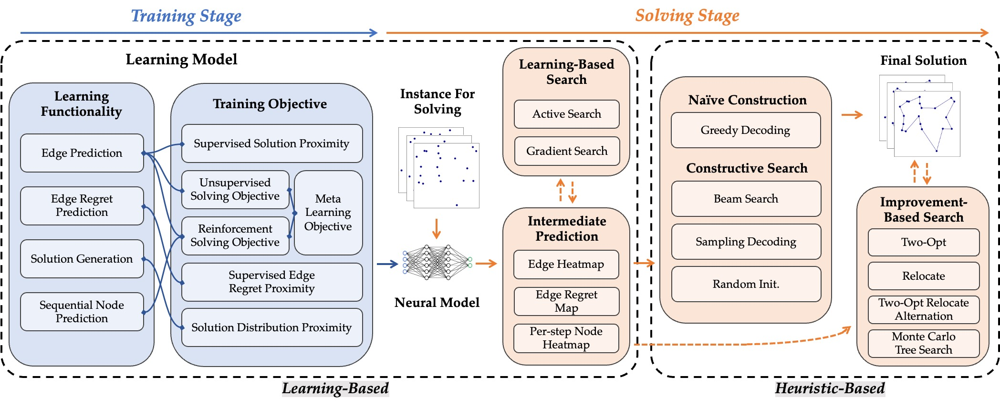

# ML4TSPBench [ICLR2025]

Official implementation of **ICLR 2025** paper: "[Unify ML4TSP: Drawing Methodological Principles for TSP and Beyond from Streamlined Design Space of Learning and Search](https://openreview.net/pdf?id=grU1VKEOLi)".

Abstract: Despite the rich works on machine learning (ML) for combinatorial optimization (CO), a unified, principled framework remains lacking. This study utilizes the Travelling Salesman Problem (TSP) as a major case study, with adaptations demonstrated for other CO problems, dissecting established mainstream learning-based solvers to outline a comprehensive design space. It advances a unified modular streamline incorporating existing technologies in both learning and search for transparent ablation, aiming to reassess the role of learning and to discern which parts of existing techniques are genuinely beneficial and which are not. This further leads to the investigation of desirable principles of learning designs and the exploration of concepts guiding method designs. We demonstrate the desirability of principles such as joint probability estimation, symmetry solution representation, and online optimization for learning-based designs. Leveraging the findings, we propose enhancements to existing methods to compensate for their missing attributes, thereby advancing performance and enriching the technique library. From a higher viewpoint, we also uncover a performance advantage in non-autoregressive and supervised paradigms compared to their counterparts. The strategic decoupling and organic recompositions yield a factory of new TSP solvers, where we investigate synergies across various method combinations and pinpoint the optimal design choices to create more powerful ML4TSP solvers, thereby facilitating and offering a reference for future research and engineering endeavors.




### Repository Organization

This repository integrates existing mainstream machine learning and search algorithms for the TSP problem, implementing a pluggable and unified pipeline. The current code corresponds to the reproducible implementation of results presented in the ICLR paper. At the same time, to simplify ML4CO code development and to facilitate adaptation to other CO problems, we have developed a task-agnostic skeleton and a common toolkit as a python library, [ML4CO-Kit](https://github.com/Thinklab-SJTU/ML4CO-Kit), which provides robust support for the development of learning-based solvers across different tasks. This toolkit incorporates the following components:


1. A generic skeleton for organizing ML4CO frameworks;
2. Base classes to streamline method development;
3. Traditional solver baselines and reference solution acquisition;
4. Data generation for various distributions;
5. Problem and solution visualization tools;
6. Evaluators for multiple problem types;
7. Common post-processing algorithms.

This toolkit focuses on facilitating method development while allowing room for customization of problem-specific implementations. With the support of this toolkit, the original code has been reorganized into an **ML4TSP library**, located in the `ml4tsp-library` directory. This includes an externally accessible `ml4tsp` package, along with related example Python code. Based on this package, one can implement model training and testing under various settings with only around ten lines of core Python code. For example:

To train a diffusion model with GNN encoder and greedy decoder (in validation steps):

```python
from ml4co_kit import Trainer
from ml4tsp import ML4TSPDiffusion, ML4TSPNAREnv, GNNEncoder, ML4TSPNARGreeyDecoder


model = ML4TSPDiffusion(
    env=ML4TSPNAREnv(
        nodes_num=50,
        mode="train",
        train_path="train_data_path",
        val_path="test_data_path",
        train_batch_size=64,
        num_workers=4,
        device="cuda",
    ),
    encoder=GNNEncoder(sparse=False, time_embed_flag=True),
    decoder=ML4TSPNARGreeyDecoder(),
    learning_rate=0.0002,
)

trainer = Trainer(model=model, devices=[0])
trainer.model_train()
```

To test a diffusion model with GNN encoder and greedy decoder with two-opt for local search:

```python
from ml4tsp import ML4TSPDiffusion, GNNEncoder, ML4TSPNARSolver, ML4TSPT2TSolver, ML4TSPNARGreeyDecoder, ML4TSPNARTwoOpt

GRADIENT_SEARCH_FLAG = False

if GRADIENT_SEARCH_FLAG:
    solver_type = ML4TSPT2TSolver
else:
    solver_type = ML4TSPNARSolver
    
solver = solver_type(
    model=ML4TSPDiffusion(
        env=ML4TSPNAREnv(nodes_num=50, sparse_factor=-1, device="cuda"),
        encoder=GNNEncoder(sparse=False, time_embed_flag=True),
        decoder=ML4TSPNARGreeyDecoder(),
        local_search=ML4TSPNARTwoOpt(),
        pretrained_path="weight_path",
        inference_diffusion_steps=50
    )
)
solver.from_txt("test_data_path", ref=True)
solver.solve(batch_size=1, show_time=True)
print(solver.evaluate(calculate_gap=True))
```


### Setup

Setup by environment.yml:

```bash
conda env create -f docs/environment.yml
```

Setup by install helper:
```bash
conda create --name ml4tsp python=3.8
conda activate ml4tsp
bash install_helper.sh
```

### Data Preparation and Pretrained Checkpoints

The full datasets used in this research can be downloaded through [Google Drive](https://drive.google.com/drive/folders/16VG-s7plG5STkIMbXWK8ObWlx93uqA1v?usp=sharing). More datasets can be generated through `generate.py`:

```bash
python generate.py --type uniform --min_nodes 50 --max_nodes 50 --num_samples 130560 --solver lkh
```

The pretrained model checkpoints of typical model configurations can be downloaded through [Google Drive](https://drive.google.com/drive/folders/1wVcrL-FAEnwCf95y37ABqDsneD3SPANw?usp=sharing).

### Train and Test

Model training and testing can be simply conducted through scripts in `scripts/train` and `scripts/test` folders:

```bash
# train
bash scripts/train/train_tsp{scale}_{model_type}.sh
# test
bash scripts/test/test_tsp{scale}_{model_type}.sh
```
Model training and testing can also be conducted by simple Python codes. For example:

```python
from models.modelzoo import TSPGNNWISE, TSPNARTrainer

model = TSPGNNWISE(
    train_file="data/tsp/uniform/train/tsp50_uniform_1.28m.txt",
    valid_file="data/tsp/uniform/valid/tsp50_uniform_val.txt",
    test_file="data/uniform/test/tsp50_concorde.txt"
)
trainer = TSPNARTrainer(model=model)
trainer.model_train()
trainer.model_test()
```

### Example of Solver Class Usage

#### Preparation For TSPNARSolver

```python
import os
import torch
import numpy as np
from solvers import TSPNARSolver, TSPARSolver
    
os.environ["CUDA_VISIBLE_DEVICES"] = "1"
    
if torch.cuda.is_available():
    device = 'cuda'
    print(f"CUDA is available. Using GPU.")
else:
    device = torch.device("cpu")
    device = 'cpu'
    print("CUDA is not available. Using CPU.")

# NAR solver
solver_nar = TSPNARSolver()
# AR solver
solver_ar = TSPARSolver()
```

#### Methods of Gaining Data

```python
# three methods to input data
# use the method 'from_txt' to read tsp data from txt text
solver_nar.from_txt("data/uniform/test/tsp50_concorde.txt")
solver_ar.from_txt("data/uniform/test/tsp50_concorde.txt")

# use the method 'from_tspfile' to read tsp data from .tsp file
solver_nar.from_tspfile("data/tsplibs/raw/read/a280.tsp")
solver_ar.from_tspfile("data/tsplibs/raw/read/a280.tsp")

# input the data just by the method 'from_data'
points = np.random.random([1280, 50, 2])
solver_nar.from_data(points)
solver_ar.from_data(points)
```

#### Solve TSP Instances

```python
# NAR solver
solver_nar.solve(
    encoder='gnn-wise',
    decoding_type="greedy", 
    ls_type="mcts",
    ls_kwargs={
        "mcts_max_depth": 10, 
        "max_iterations_2opt": 1000
    },
    device='cuda',
)

avg_cost = solver_nar.evaluate()
# output the solution by the method 'to_txt'
solver_nar.to_txt("output_nar.txt")

# AR solver
solver_ar.solve(
    batch_size=8,
    encoder='pomo',
    decoding_type="greedy", 
    ls_type="2opt",
    device='cuda',
)

avg_cost = solver_ar.evaluate()
# output the solution by the method 'to_txt'
solver_ar.to_txt("output_ar.txt")
```

### Reference

If you found this codebase useful, please consider citing the paper:

```
@inproceedings{li2025ml4tsp,
    title={Unify ML4TSP: Drawing Methodological Principles for TSP and Beyond from Streamlined Design Space of Learning and Search}, 
    author={Yang Li and Jiale Ma and Wenzheng Pan and Runzhong Wang and Haoyu Geng and Nianzu Yang and Junchi Yan},
    year={2025},
    booktitle={International Conference on Learning Representations}
}
```
